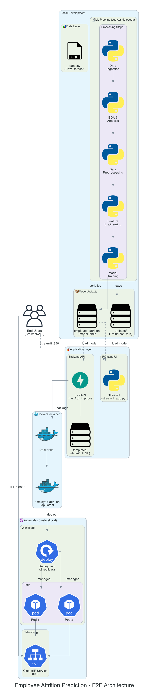
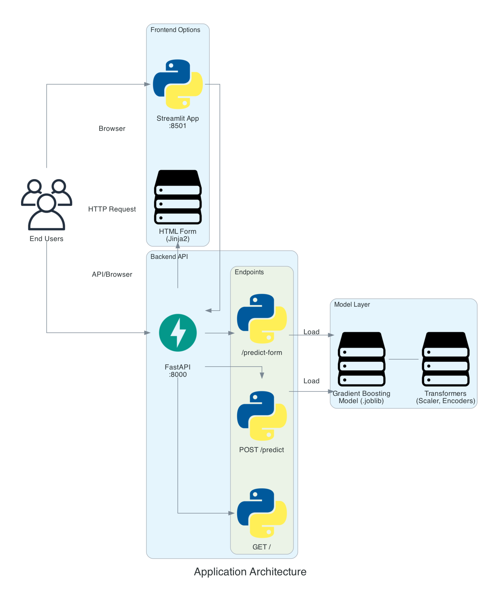
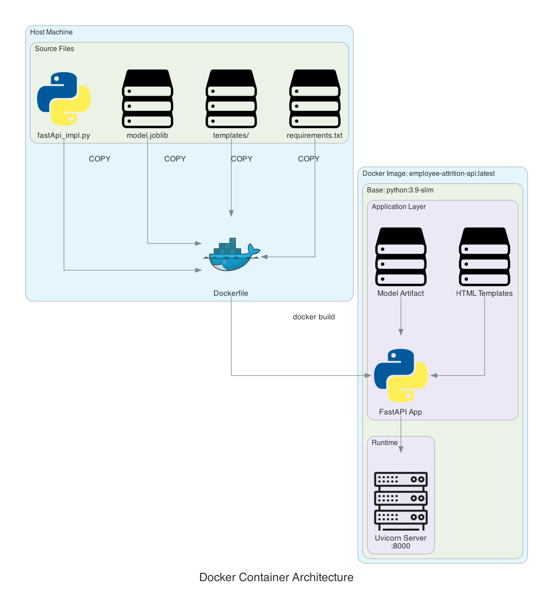
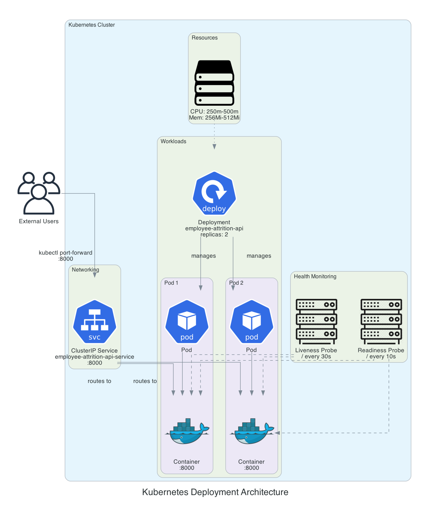
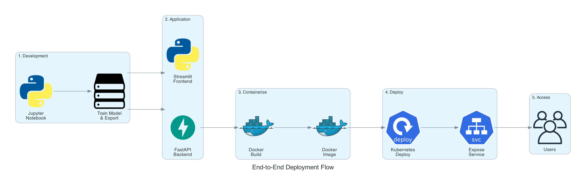

# Employee Attrition Prediction

A machine learning-powered web application that predicts employee attrition using advanced ensemble methods. Built with **Gradient Boosting** classifier with hyperparameter tuning and deployed with both **Streamlit** and **FastAPI** options.

## Problem Statement

Employee attrition is one of the most significant challenges in HR analytics. Replacing an employee costs nearly **50–250% of their annual salary**. This predictive model helps organizations:

- Identify employees at risk of leaving early
- Enable proactive retention strategies
- Reduce recruitment and training costs
- Improve workforce planning and stability

## Features

- **Real-time Prediction**: Instant attrition risk assessment
- **Comprehensive Input Form**: 22 employee attributes across personal, educational, and professional domains
- **High Accuracy**: 74.5% F1-score on test data with low overfitting risk (Gradient Boosting with hyperparameters)
- **Interactive UI**: Available as both Streamlit dashboard and FastAPI REST API with OpenAPI documentation
- **Production-Ready**: Complete preprocessing pipeline saved as a single artifact

## Project Structure

```
employee_attrition_prediction/
├── streamlit_app.py                    # Streamlit web application
├── fastApi_impl.py                     # FastAPI REST API application
├── templates/
│   └── index.html                      # FastAPI web UI
├── employee_attrition_prediction.ipynb # Complete ML pipeline (EDA, training, evaluation)
├── employee_attrition_model.joblib     # Trained model + preprocessing artifacts
├── regenerate_model.py                 # Script to regenerate model artifact
├── data.csv                            # Dataset (59,603 records, 24 features)
├── requirements.txt                    # Python dependencies
├── Dockerfile                          # Docker container configuration
├── deployment.yaml                     # Kubernetes deployment manifest
├── artifacts/                          # Train/Test split data
│   ├── x_train.csv
│   ├── x_test.csv
│   ├── y_train.csv
│   └── y_test.csv
├── diagrams/                           # Architecture diagrams
│   ├── architecture.png                # Complete E2E architecture
│   ├── app_architecture.png            # Application layer
│   ├── docker_architecture.png         # Docker container
│   ├── k8s_architecture.png            # Kubernetes deployment
│   └── e2e_flow.png                    # Deployment pipeline flow
├── generate_diagrams.py                # Script to generate all architecture diagrams
└── README.md                           # Project documentation
```

## 🏗️ System Architecture

### End-to-End Architecture Overview



The Employee Attrition Prediction system follows a modern ML architecture with the following layers:

```
┌─────────────────────────────────────────────────────────────────────────────────────────--┐
│                              DATA → ML PIPELINE → DEPLOYMENT                              │
├─────────────────────────────────────────────────────────────────────────────────────────--┤
│                                                                                           │
│  ┌─────────────┐   ┌─────────────┐   ┌─────────────┐   ┌─────────────┐   ┌───────────┐    │
│  │    Data     │──▶│     EDA     │──▶│    Data     │──▶│   Feature   │──▶│   Model   │    │
│  │  Ingestion  │   │  Analysis   │   │Preprocessing│   │ Engineering │   │  Training │    │
│  └─────────────┘   └─────────────┘   └─────────────┘   └─────────────┘   └───────────┘    │
│        │                                                                       │          │
│        ▼                                                                       ▼          │
│   [data.csv]                                              [employee_attrition_model.joblib]
│                                                                                │          │
│                    ┌───────────────────────────────────────────────────────────┘          │
│                    ▼                                                                      │
│  ┌─────────────────────────────────────────────────────────────────────────────────-┐      │
│  │                           APPLICATION LAYER                                      │     │
│  │     ┌─────────────────┐                    ┌─────────────────┐                   │     │
│  │     │   FastAPI API   │◀──── HTTP ────────▶│   Streamlit UI  │                   │     │
│  │     │     :8000       │                    │      :8501      │                   │     │
│  │     └────────┬────────┘                    └─────────────────┘                   │     │
│  └──────────────┼──────────────────────────────────────────────────────────────────-┘      │
│                 ▼                                                                         │
│  ┌─────────────────────────────────────────────────────────────────────────────────-┐      │
│  │                           CONTAINERIZATION                                       │     │
│  │                    ┌─────────────────────────────┐                               │     │
│  │                    │    Docker Container         │                               │     │
│  │                    │    employee-attrition-api   │                               │     │
│  │                    └──────────────┬──────────────┘                               │     │
│  └───────────────────────────────────┼──────────────────────────────────────────────┘     │
│                                      ▼                                                    │
│  ┌─────────────────────────────────────────────────────────────────────────────────┐      │
│  │                           KUBERNETES ORCHESTRATION                              │     │
│  │     ┌──────────────┐    ┌──────────────┐    ┌──────────────┐                    │      │ 
│  │     │  Deployment  │───▶│   Pod (x2)   │◀───│   Service    │                    │      │
│  │     │  (2 replicas)│    │   :8000      │    │  ClusterIP   │                    │      │
│  │     └──────────────┘    └──────────────┘    └──────────────┘                    │      │
│  └─────────────────────────────────────────────────────────────────────────────────┘      │
│                                      │                                                    │
│                                      ▼                                                    │
│                              ┌──────────────┐                                             │
│                              │   End Users  │                                             │
│                              └──────────────┘                                             │
└─────────────────────────────────────────────────────────────────────────────────────────--┘
```

### Application Architecture



| Component | Technology | Port | Purpose |
|-----------|------------|------|---------|
| **Backend API** | FastAPI + Uvicorn | 8000 | REST API for predictions, Swagger docs |
| **Frontend UI** | Streamlit | 8501 | Interactive web dashboard |
| **Web Form** | Jinja2 Templates | 8000 | HTML form served by FastAPI |
| **Model** | Gradient Boosting | - | Serialized with joblib |

**API Endpoints:**
| Endpoint | Method | Description |
|----------|--------|-------------|
| `/` | GET | Health check |
| `/predict` | POST | JSON prediction API |
| `/predict-form` | GET/POST | HTML form interface |
| `/docs` | GET | Swagger documentation |

### Docker Architecture



```dockerfile
# Image Structure
FROM python:3.9-slim
├── /app
│   ├── fastApi_impl.py      # Application code
│   ├── employee_attrition_model.joblib  # Model artifact
│   ├── templates/           # HTML templates
│   └── requirements.txt     # Dependencies
└── EXPOSE 8000 → Uvicorn Server
```

**Docker Commands:**
```bash
# Build image
docker build -t employee-attrition-api:latest .

# Run container
docker run -p 8000:8000 employee-attrition-api:latest

# Run with environment variables
docker run -p 8000:8000 -e LOG_LEVEL=debug employee-attrition-api:latest
```

### Kubernetes Architecture



**Deployment Specifications:**
| Resource | Configuration |
|----------|---------------|
| **Replicas** | 2 pods for high availability |
| **CPU** | Request: 250m, Limit: 500m |
| **Memory** | Request: 256Mi, Limit: 512Mi |
| **Service Type** | ClusterIP (internal) |
| **Health Checks** | Liveness & Readiness probes on `/` |

**Kubernetes Resources:**
```yaml
# Deployment
apiVersion: apps/v1
kind: Deployment
metadata:
  name: employee-attrition-api
spec:
  replicas: 2
  ...

# Service  
apiVersion: v1
kind: Service
metadata:
  name: employee-attrition-api-service
spec:
  type: ClusterIP
  ports:
  - port: 8000
```

**Access Commands:**
```bash
# Deploy to cluster
kubectl apply -f deployment.yaml

# Port forward to local machine
kubectl port-forward svc/employee-attrition-api-service 8000:8000

# Check pod status
kubectl get pods -l app=employee-attrition-api

# View logs
kubectl logs -l app=employee-attrition-api --tail=100
```

### E2E Deployment Flow



```
┌──────────────┐    ┌──────────────┐    ┌──────────────┐    ┌──────────────┐    ┌──────────────┐
│ 1. DEVELOP   │───▶│ 2. PACKAGE   │───▶│ 3. CONTAIN-  │───▶│ 4. DEPLOY    │───▶│ 5. ACCESS    │
│              │    │              │    │    ERIZE     │    │              │    │              │
│ • Jupyter    │    │ • FastAPI    │    │ • Docker     │    │ • Kubernetes │    │ • Browser    │
│ • Train ML   │    │ • Streamlit  │    │ • Build      │    │ • kubectl    │    │ • API Client │
│ • Export     │    │ • Templates  │    │ • Push       │    │ • Scale      │    │ • curl       │
└──────────────┘    └──────────────┘    └──────────────┘    └──────────────┘    └──────────────┘
```

### Component Summary

| Layer | Component | Technology | Purpose |
|-------|-----------|------------|---------|
| **Data** | data.csv | CSV + DVC | Raw employee data with versioning |
| **ML Pipeline** | Notebook | Jupyter + scikit-learn | EDA, preprocessing, model training |
| **Artifacts** | .joblib | Joblib + MLflow | Serialized model + transformers |
| **Backend** | FastAPI | Python + Uvicorn | REST API for predictions |
| **Frontend** | Streamlit | Python | Interactive web UI |
| **Container** | Docker | Dockerfile | Portable deployment package |
| **Orchestration** | Kubernetes | K8s YAML | Scalable production deployment |

### Data Flow

```
User Input → Validation (Pydantic) → Preprocessing Pipeline → Model Inference → Prediction Response
                                           │
                                           ├── Binary Encoding
                                           ├── Ordinal Encoding  
                                           ├── One-Hot Encoding
                                           ├── Power Transform
                                           └── Standard Scaling
```

### ML Pipeline Steps

| Step | Name | Description |
|------|------|-------------|
| 1 | **Data Ingestion** | Load employee dataset from CSV (59,602 rows, 24 columns) |
| 2 | **Exploratory Data Analysis** | Distribution analysis, correlation, skewness check, outlier detection |
| 3 | **Data Cleaning** | Handle duplicates (none found) and missing values (none found) |
| 4 | **Feature Encoding** | Binary (6 cols), Ordinal (8 cols), One-Hot (2 cols → multiple) |
| 5 | **Outlier Treatment** | IQR capping + domain knowledge (Years at Company capped at 40) |
| 6 | **Skewness Handling** | Yeo-Johnson Power Transform for skewed features |
| 7 | **Feature Engineering** | Combined Leadership + Innovation → Opportunities |
| 8 | **Multicollinearity Check** | VIF analysis (Monthly Income retained despite high VIF) |
| 9 | **Data Splitting** | 70-30 train-test split with stratification |
| 10 | **Feature Scaling** | StandardScaler normalization |
| 11 | **Model Training** | Gradient Boosting with hyperparameter tuning |
| 12 | **Model Evaluation** | Accuracy, Precision, Recall, F1, 10-fold CV |
| 13 | **Model Serialization** | Export to joblib with all transformers |

## Quick Start

### Prerequisites

- Python 3.8 or higher
- pip package manager

### Local Installation & Testing

1. **Clone the repository**
   ```bash
   git clone https://github.com/BharathVasanth12/employee-attrition-prediction.git
   cd employee-attrition-prediction
   ```

2. **Install dependencies**
   ```bash
   pip install -r requirements.txt
   ```

3. **Run the Application**

   **Option A: Streamlit Dashboard** (Recommended for quick testing)
   ```bash
   streamlit run streamlit_app.py
   ```
   - Opens automatically at `http://localhost:8501`
   - Interactive web UI with sidebar information
   - Real-time predictions

   **Option B: FastAPI REST API** (Recommended for production/integration)
   ```bash
   uvicorn fastApi_impl:app --reload --port 8001
   ```
   - **Web UI**: `http://localhost:8001`
   - **API Documentation (Swagger)**: `http://localhost:8001/docs`
   - **Alternative API Docs (ReDoc)**: `http://localhost:8001/redoc`
   - **Health Check**: `http://localhost:8001/` (GET)
   - **Prediction Endpoint**: `http://localhost:8001/predict` (POST)

4. **Test the API** (FastAPI only)
   
   Using curl:
   
   **Example 1: Employee likely to STAY**
   ```bash
   curl -X POST "http://localhost:8001/predict" \
     -H "Content-Type: application/json" \
     -d '{
       "age": 35,
       "gender": "Male",
       "marital_status": "Married",
       "num_dependents": 2,
       "distance_home": 10,
       "remote_work": "Yes",
       "education_level": "Bachelor'\''s Degree",
       "job_level": "Mid",
       "job_role": "Technology",
       "years_company": 5,
       "company_tenure": 5,
       "num_promotions": 1,
       "monthly_income": 50000,
       "overtime": "No",
       "work_life_balance": "Good",
       "job_satisfaction": "High",
       "performance_rating": "High",
       "company_size": "Large",
       "company_reputation": "Good",
       "employee_recognition": "Medium",
       "leadership_opportunities": "Yes",
       "innovation_opportunities": "Yes"
     }'
   ```
   
   **Example 2: Employee likely to LEAVE**
   ```bash
   curl -X POST "http://localhost:8001/predict" \
     -H "Content-Type: application/json" \
     -d '{
       "age": 28,
       "gender": "Female",
       "marital_status": "Single",
       "num_dependents": 0,
       "distance_home": 45,
       "remote_work": "No",
       "education_level": "High School",
       "job_level": "Entry",
       "job_role": "Healthcare",
       "years_company": 1,
       "company_tenure": 1,
       "num_promotions": 0,
       "monthly_income": 3500,
       "overtime": "Yes",
       "work_life_balance": "Poor",
       "job_satisfaction": "Low",
       "performance_rating": "Below Average",
       "company_size": "Small",
       "company_reputation": "Poor",
       "employee_recognition": "Low",
       "leadership_opportunities": "No",
       "innovation_opportunities": "No"
     }'
   ```
   
   Or visit `http://localhost:8001/docs` for interactive API testing

## Containerization & Deployment

### Docker Deployment

Build and run the application using Docker:

```bash
# Build the Docker image
docker build -t employee-attrition-api:latest .

# Run the container
docker run -p 8000:8000 employee-attrition-api:latest
```

Access the application at `http://localhost:8000`

### Podman Deployment

Build and run the application using Podman (Docker alternative):

```bash
# Build the Podman image
podman build -t employee-attrition-api:latest .

# Run the container
podman run -p 8000:8000 employee-attrition-api:latest
```

Access the application at `http://localhost:8000`

### Kubernetes Deployment (Kind Cluster)

Deploy the application to a local Kubernetes cluster using Kind:

**Prerequisites:**
- [Kind](https://kind.sigs.k8s.io/docs/user/quick-start/#installation) installed
- [kubectl](https://kubernetes.io/docs/tasks/tools/) installed
- Docker or Podman installed

**Deployment Steps:**

1. **Create a Kind cluster**
   ```bash
   kind create cluster
   ```

2. **Verify cluster is running**
   ```bash
   kubectl get nodes
   ```

3. **Build the Docker image** (if not already built)
   ```bash
   docker build -t employee-attrition-api:latest .
   ```

4. **Load the image into Kind cluster**
   ```bash
   kind load docker-image employee-attrition-api:latest
   ```

5. **Deploy to Kubernetes**
   ```bash
   kubectl apply -f deployment.yaml
   ```

6. **Verify deployment**
   ```bash
   # Check pods are running
   kubectl get pods
   
   # Check service is created
   kubectl get svc
   ```

7. **Access the application**
   ```bash
   # Forward port to local machine
   kubectl port-forward svc/employee-attrition-api-service 8000:8000
   ```
   
   Access at `http://localhost:8000`

**Kubernetes Resources:**
- **Deployment**: 2 replicas with resource limits (256Mi-512Mi memory, 250m-500m CPU)
- **Service**: ClusterIP type exposing port 8000
- **Health Checks**: Liveness and readiness probes configured

**Cleanup:**
```bash
# Delete deployment
kubectl delete -f deployment.yaml

# Delete Kind cluster
kind delete cluster
```

## Deploy to Streamlit Cloud

### Option 1: Deploy via Streamlit Cloud UI

1. **Push your code to GitHub**
   ```bash
   git add .
   git commit -m "Initial commit"
   git push origin main
   ```

2. **Go to [Streamlit Cloud](https://share.streamlit.io/)**

3. **Click "New app"** and connect your GitHub repository

4. **Configure deployment settings:**
   - Repository: `BharathVasanth12/employee-attrition-prediction`
   - Branch: `main`
   - Main file path: `streamlit_app.py`
   - Python version: `3.9` (or higher)

5. **Click "Deploy"** and wait for the app to build

## Dataset

- **Source**: [Kaggle - Employee Attrition Dataset](https://www.kaggle.com/datasets/stealthtechnologies/employee-attrition-dataset)
- **Size**: 59,603 employee records
- **Features**: 24 attributes including:
  - **Personal**: Age, Gender, Marital Status, Number of Dependents
  - **Educational**: Education Level, Job Role
  - **Professional**: Years at Company, Job Satisfaction, Performance Rating, Monthly Income, Overtime, Work-Life Balance
  - **Workplace**: Company Size, Remote Work, Leadership Opportunities, Employee Recognition
- **Target**: Binary classification (Stayed / Left)

## Model Architecture

### Preprocessing Pipeline

1. **Missing Value Imputation**
   - Numeric: Median (if outliers exist) or Mean
   - Categorical: Mode

2. **Encoding Strategy** (order matters!)
   - **Binary Encoding**: Gender, Overtime, Remote Work, Leadership/Innovation Opportunities (6 columns)
   - **Ordinal Encoding**: Job Satisfaction, Education Level, Job Level, etc. (8 columns)
   - **OneHot Encoding**: Job Role, Marital Status (drop='first')

3. **Feature Engineering**
   - Combined `Leadership Opportunities` + `Innovation Opportunities` → `Opportunities`

4. **Outlier Handling**
   - `Years at Company`: Capped at 40 years (max observed: 51)

5. **Skewness Correction**
   - PowerTransformer (Yeo-Johnson) applied to: `Number of Dependents`, `Number of Promotions`, `Years at Company`

6. **Scaling**
   - StandardScaler fit on training data

### Model Performance

**Algorithm**: Gradient Boosting Classifier with Hyperparameter Tuning

**Hyperparameters**:
- `learning_rate`: 0.1
- `max_depth`: 3
- `n_estimators`: 200
- `subsample`: 0.7
- `random_state`: 42

**Performance Metrics**:

| Metric | Training | Testing | 10-Fold CV |
|--------|----------|---------|------------|
| **Accuracy** | 76.7% | 75.8% | 75.8% |
| **Precision** | 75.5% | 74.7% | - |
| **Recall** | 75.3% | 74.2% | - |
| **F1-Score** | **75.4%** | **74.5%** | **75.8%** |
| **Overfitting Risk** | - | - | **Low** |

**Model Selection**: After evaluating multiple algorithms (AdaBoost, XGBoost, Random Forest, etc.), Gradient Boosting with hyperparameter tuning showed the best balance between performance and generalization.

## Usage

### Web Application

1. Navigate to the deployed app or run locally
2. Fill in employee details across three sections:
   - **Personal Details**: Age, Gender, Marital Status, etc.
   - **Education & Career Level**: Education, Job Role, Job Level
   - **Workplace & Performance**: Years at Company, Salary, Satisfaction, etc.
3. Click **"Predict Attrition"**
4. View instant prediction: Employee Will Stay or Employee Will Leave

### Retraining the Model

Execute the Jupyter notebook cells sequentially:

```bash
jupyter notebook employee_attrition_prediction.ipynb
```

**Critical cell sequence:**
1. Load data + EDA (Cells 1-41)
2. Binary → Ordinal → OneHot encoding (Cells 54-60)
3. Outlier capping + Skewness transformation (Cells 62-66)
4. Feature engineering (Cell 69)
5. Train/test split + Scaling (Cells 82-88)
6. Gradient Boosting training with hyperparameters (Cell 101)
7. Save artifact (Cell 102) → generates `employee_attrition_model.joblib`

**Alternative: Use Python Script** (Recommended)
```bash
python regenerate_model.py
```
This script regenerates the model artifact with the current environment's package versions, ensuring compatibility.

## Dependencies

Core libraries:
```
streamlit
scikit-learn
xgboost
pandas
numpy
matplotlib
seaborn
scipy
joblib
imbalanced-learn
```

Optional (for experiment tracking):
```
mlflow<3
dvc
dvc-s3
```

See `requirements.txt` for complete list.

## Configuration

### Model Artifact Structure

The `employee_attrition_model.joblib` contains:
- Trained Gradient Boosting model (with hyperparameters: learning_rate=0.1, max_depth=3, n_estimators=200, subsample=0.7)
- OneHotEncoder (for Job Role, Marital Status)
- StandardScaler
- PowerTransformer (for skewness correction)
- Binary encoding mappings
- Ordinal encoding mappings
- Feature column names (for alignment)

**Important**: Always regenerate the model artifact in the same Python environment where it will be deployed to avoid version compatibility issues.

## Contributing

Contributions are welcome! Please follow these steps:

1. Fork the repository
2. Create a feature branch (`git checkout -b feature/amazing-feature`)
3. Commit your changes (`git commit -m 'Add amazing feature'`)
4. Push to the branch (`git push origin feature/amazing-feature`)
5. Open a Pull Request

## Acknowledgments

- Dataset: [Stealth Technologies on Kaggle](https://www.kaggle.com/datasets/stealthtechnologies/employee-attrition-dataset)
- Built with [Streamlit](https://streamlit.io/)
- ML framework: [scikit-learn](https://scikit-learn.org/)

## Contact

For questions or feedback, please open an issue or reach out via GitHub.

---

**Star this repo** if you find it helpful!
